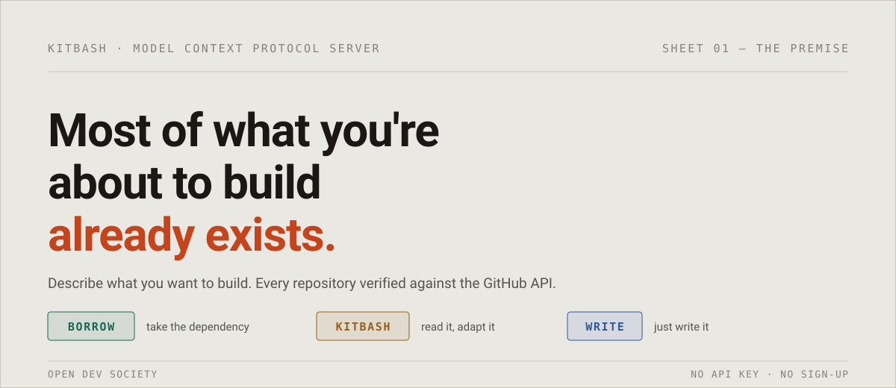
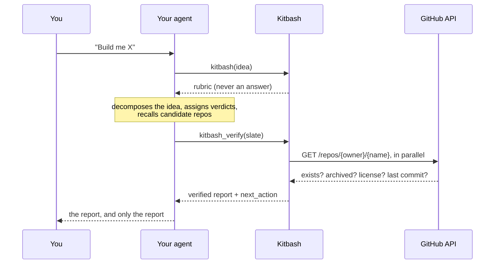

<div align="center">
  <br />
  
  <br />
  <sub>© Open Dev Society. Licensed under GPL-2.0. If you modify and redistribute it, you must release your source under the same license and credit the original authors.</sub>
  <br />
  <br />

  <div>
    
    
    
    
    
    
    [](https://skills.sh/open-dev-society/kitbash)
  </div>
</div>

# Kitbash

Kitbash is an open-source MCP server that tells your AI agent which parts of your idea
already exist, which to adapt, and which to just write. It deletes the repos that don't
exist before you ever see them. Built openly, for everyone, forever free.

```bash
claude mcp add kitbash -- npx -y github:Open-Dev-Society/kitbash
```

No API key. No sign-up. Works in Claude Code, Cursor, Claude Desktop, VS Code, Codex,
Windsurf, and any other agent that speaks MCP.

## 📋 Table of Contents

1. ✨ [Introduction](#introduction)
2. 🌍 [Open Dev Society Manifesto](#manifesto)
3. 🔍 [What It Looks Like](#what-it-looks-like)
4. 🔋 [Features](#features)
5. 🤸 [Quick Start](#quick-start)
6. 💬 [Usage](#usage)
7. ⚙️ [How It Works](#how-it-works)
8. 🔐 [GitHub Token](#github-token)
9. ☁️ [Self-Hosting](#self-hosting)
10. 🧱 [Project Structure](#project-structure)
11. 🧪 [Scripts & Tooling](#scripts--tooling)
12. 🤝 [Contributing](#contributing)
13. 🛡️ [Security](#security)
14. 📜 [License](#license)
15. 🙏 [Acknowledgements](#acknowledgements)

## ✨ Introduction <a name="introduction"></a>

Your coding agent will happily rewrite a PDF parser for you. It'll take twenty minutes
and it'll look completely correct.

It won't be. PDF parsing is years of edge cases that appear in no spec: broken xref
tables, CID fonts with no ToUnicode map. The same goes for timezone math, OAuth, Unicode
normalization, container muxing, and rate limiting under contention. You find out in
production.

The opposite trap is just as common: pulling in a dependency to save twenty lines of glue.

Search can't help. It ranks by popularity, not fit, so the right small library stays
buried on page four. And when a model will write anything in twenty minutes, rebuilding
*feels* free, so nobody looks first.

**Kitbash is the ten-second judgment a senior developer makes before writing anything,
turned into a tool.** It doesn't make you ship faster. It makes you ship less. Four
components you never build beat four components you build quickly.

Every part of your idea gets one verdict:

| Verdict | Meaning |
|---|---|
| 🟢 **BORROW** | A maintained library exists and the correctness was hard-won. Rewriting it is the mistake. Take the dependency. |
| 🟡 **KITBASH** | A good reference exists but isn't a clean fit. Read it, adapt the approach, leave the dependency. |
| 🔵 **WRITE** | Generic enough that your agent should just write it. A component you never take on is one you never maintain. |

## 🌍 Open Dev Society Manifesto <a name="manifesto"></a>

We live in a world where knowledge is hidden behind paywalls. Where tools are locked in subscriptions. Where information is twisted by bias. Where newcomers are told they're not "good enough" to build.

We believe there's a better way.

- Our Belief: Technology should belong to everyone. Knowledge should be open, free, and accessible. Communities should welcome newcomers with trust, not gatekeeping.
- Our Mission: Build free, open-source projects that make a real difference:
    - Tools that professionals and students can use without barriers.
    - Knowledge platforms where learning is free, forever.
    - Communities where every beginner is guided, not judged.
    - Resources that run on trust, not profit.
- Our Promise: We will never lock knowledge. We will never charge for access. We will never trade trust for money. We run on transparency, donations, and the strength of our community.
- Our Call: If you've ever felt you didn't belong, struggled to find free resources, or wanted to build something meaningful — you belong here.

Because the future belongs to those who build it openly.

## 🔍 What It Looks Like <a name="what-it-looks-like"></a>

Real output for *"a CLI that ingests podcast RSS, transcribes episodes, and makes them
searchable."* Every repo returned `200` from the GitHub API seconds before it was printed.

| # | Component | Verdict | Part | Stars | License |
|---|---|---|---|---|---|
| 01 | Podcast feed parsing | 🟢 **BORROW** | [gpodder/podcastparser](https://github.com/gpodder/podcastparser) | 144 | ISC |
| 02 | Speech-to-text | 🟢 **BORROW** | [SYSTRAN/faster-whisper](https://github.com/SYSTRAN/faster-whisper) | 24,000 | MIT |
| 03 | Transcript search index | 🟡 **KITBASH** | [simonw/sqlite-utils](https://github.com/simonw/sqlite-utils) | 2,100 | Apache-2.0 |
| 04 | Episode pipeline and CLI | 🔵 **WRITE** | *yours: about a hundred lines* | — | — |

Two things to notice:

- **A 144-star repo beat a 2,400-star one for the lead slot.** `podcastparser` is the parser
  the gPodder client actually uses. It streams instead of building the XML tree, and it
  already normalizes the `itunes:duration` mess. `feedparser` is the popular fallback,
  ranked second. Surfacing the exact fit GitHub search buries is the whole product.
- **It told you to write part 04 yourself**, and argued for it: *"The interesting state
  here is domain state, not queue state. Transcription is minutes per episode, so the only
  checkpoint that matters is a row per episode with a status column. Any task-queue
  dependency would still leave you writing that row yourself."* A tool that recommends a
  repo for everything is a tool nobody believes, so WRITE is a required outcome.

## 🔋 Features <a name="features"></a>

- **Decomposition with judgment**
    - Splits an idea into 3–6 functionally distinct components, refusing to split one library's job three ways
    - A built-in hazard list (PDF, crypto, timezones, OAuth, codecs, Unicode, rate limiting, …) steers hard-won domains toward BORROW
    - WRITE is mandatory. A slate with zero WRITE components gets sent back for review
- **Fit over popularity**
    - The under-starred exact fit ranks ahead of the popular general-purpose library
    - The agent's own ordering leads, and repo health can only *demote*. Stars are a weak signal on purpose
    - Target stack and license constraints shape every recommendation
- **Live verification**
    - Every `owner/name` is resolved against the GitHub API. Repos that don't exist are dropped and counted in the report
    - Archived, disabled, unlicensed, forked, renamed, and abandoned repos are flagged
    - BORROW on a repo nobody has touched in two years gets a loud warning
    - If every candidate for a component dies, the agent is sent back for replacements before it can answer
    - About 950 ms to verify 10 repos, in parallel
- **Honest under failure**
    - Rate limits and outages are reported as "couldn't check", never as "doesn't exist"
    - An offline snapshot fills network gaps, and every cached record is labelled cached
- **Install it your way**
    - Claude Code plugin, local MCP server, remote connector, or plain agent skill with no MCP at all
    - Zero config: picks up your existing `gh` login

## 🤸 Quick Start <a name="quick-start"></a>

Prerequisites: Node.js 18+. A GitHub token is optional but recommended (see
[GitHub Token](#github-token)).

### Claude Code plugin

```
/plugin marketplace add Open-Dev-Society/kitbash
/plugin install kitbash@kitbash
```

### MCP server

```bash
claude mcp add kitbash -- npx -y github:Open-Dev-Society/kitbash     # Claude Code
codex mcp add kitbash -- npx -y github:Open-Dev-Society/kitbash      # Codex CLI
```

<details>
<summary><b>Cursor, Claude Desktop, Windsurf</b></summary>

Add to `~/.cursor/mcp.json`, `claude_desktop_config.json`, or your client's MCP config:

```json
{
  "mcpServers": {
    "kitbash": { "command": "npx", "args": ["-y", "github:Open-Dev-Society/kitbash"] }
  }
}
```

</details>

<details>
<summary><b>VS Code</b></summary>

Add to `.vscode/mcp.json`:

```json
{
  "servers": {
    "kitbash": { "type": "stdio", "command": "npx", "args": ["-y", "github:Open-Dev-Society/kitbash"] }
  }
}
```

</details>

<details>
<summary><b>Windows</b></summary>

Native Windows needs `npx` wrapped in `cmd`:

```json
{ "command": "cmd", "args": ["/c", "npx", "-y", "github:Open-Dev-Society/kitbash"] }
```

</details>

The first launch installs and builds the package, which takes about 25 seconds. After
that it starts in about 3.

### Remote connector (claude.ai, ChatGPT, any client that takes a URL)

Kitbash speaks Streamable HTTP with no auth. Run your own endpoint (see
[Self-Hosting](#self-hosting)) and add it as a custom connector:

```
https://YOUR-DEPLOYMENT/mcp
```

### Agent skill (no MCP required)

```bash
npx skills add Open-Dev-Society/kitbash
```

This installs [`skills/kitbash/SKILL.md`](skills/kitbash/SKILL.md) into Claude Code, Cursor,
Codex, and [every other agent skills.sh supports](https://skills.sh). The skill carries the
same rubric, and verification runs through `npx github:Open-Dev-Society/kitbash verify`:
the same fact-checker without an MCP connection.

## 💬 Usage <a name="usage"></a>

Describe something you were about to build:

> Use kitbash: a desktop app that watches a folder and makes scanned PDFs searchable. TypeScript, MIT.

Saying "use kitbash" helps. Otherwise the agent sometimes answers from its own knowledge
and skips the tool. A run takes about a minute. Naming your stack and license is
optional, but it sharpens every recommendation.

## ⚙️ How It Works <a name="how-it-works"></a>

**There is no model inside this server.** That's the design, not a shortcut.

Recall is the product: knowing that a 144-star parser exists at all. The best recall
available is in the model already running your session, which is far larger than anything
this server could afford to host. So Kitbash doesn't try to out-remember it. It aims that
recall, then stops it from lying.



1. **`kitbash`** returns a rubric and nothing else. It never returns anything that could
   pass for an answer. If it did, the agent would show it and skip verification.
2. **`kitbash_verify`** fact-checks the slate. It drops the repos that don't exist,
   attaches health signals, ranks the survivors, and renders the report the user sees.

A model asked for repo names produces plausible ones, and invented names look completely
real in a chat window. Step 2 is the only reason to trust step 1: **every repo in the
final report was confirmed to exist seconds before you saw it.**

## 🔐 GitHub Token <a name="github-token"></a>

Kitbash works without a token, but GitHub limits unauthenticated use to 60 requests an
hour. It picks up a token from these sources, in order:

1. `GITHUB_TOKEN`
2. `GH_TOKEN`
3. `gh auth token` (if the GitHub CLI is logged in, there's nothing to configure)

A token needs no scopes. Without one, private repos look the same as nonexistent ones
(both 404), so they'll be reported as not found.

## ☁️ Self-Hosting <a name="self-hosting"></a>

The same package serves Streamable HTTP for remote connectors:

```bash
git clone https://github.com/Open-Dev-Society/kitbash.git && cd kitbash
npm ci
GITHUB_TOKEN=ghp_… PORT=3000 npm run start:http    # → http://localhost:3000/mcp
```

Deploy it anywhere that runs Node 18+ (Render, Railway, Fly.io, a VPS) with build command
`npm ci` and start command `npm run start:http`.

- **Stateless:** a fresh server per request. Nothing from one caller reaches the next.
- **Bounded:** at most 12 components and 5 repos per component, so no single caller can
  drain the shared token.
- **Set `GITHUB_TOKEN`:** every caller shares its 5,000 requests an hour, and verification
  makes one request per candidate repo.

## 🧱 Project Structure <a name="project-structure"></a>

```
src/
├── index.ts            entrypoint: stdout guard, mode dispatch (stdio · --http · verify)
├── server.ts           MCP server assembly; stdio and Streamable HTTP transports
├── rubric.ts           the rubric the agent follows — this file is the product
├── tools/
│   ├── plan.ts         `kitbash` tool: hands out the rubric
│   └── verify.ts       `kitbash_verify` tool and CLI: fetch, assess, rank, report
├── github/
│   ├── client.ts       REST transport and error classification (404 vs rate limit vs auth)
│   ├── repos.ts        batched, deduplicated repo fetches
│   └── token.ts        token resolution ladder
├── score.ts            health assessment, disqualification, ranking
├── render.ts           the markdown report
├── cache.ts            offline snapshot
├── types.ts            the frozen contract every module depends on
└── scripts/            snapshot pre-warm, rubric example check, skill generator
skills/kitbash/         the agent skill (generated from rubric.ts)
plugin/                 the Claude Code plugin
.claude-plugin/         the plugin marketplace manifest
server.json             MCP Registry manifest
site/                   landing page
```

## 🧪 Scripts & Tooling <a name="scripts--tooling"></a>

| Command | What it does |
|---|---|
| `npm run build` | Compile TypeScript to `build/` |
| `npm run typecheck` | Type-check without emitting |
| `npm start` | Build and run the stdio server |
| `npm run start:http` | Run the Streamable HTTP server on `$PORT` (default 3000) |
| `npm run skill` | Regenerate `skills/kitbash/SKILL.md` from the rubric |
| `npm run check:examples` | Confirm every repo named in the rubric still exists |
| `npm run snapshot -- owner/name …` | Pre-warm the offline snapshot |
| `kitbash-mcp verify < slate.json` | Verify a slate from the shell |

## 🤝 Contributing <a name="contributing"></a>

Contributions are welcome, from code to docs to a better worked example in the rubric.
Start with the [Open Dev Society contribution guidelines](https://github.com/Open-Dev-Society/.github/blob/main/CONTRIBUTING.md),
then look for issues labelled `good first issue`.

```bash
git clone https://github.com/Open-Dev-Society/kitbash.git && cd kitbash
npm install
claude mcp add kitbash-dev -- node "$(pwd)/build/index.js"
```

Things that will bite you in this codebase:

- **stdout is the JSON-RPC channel.** One `console.log` anywhere corrupts the protocol and
  the server dies silently. Log with `console.error`. `src/index.ts` reroutes
  `console.log`/`info`/`debug` to stderr as a backstop.
- **Local imports need explicit `.js` extensions.** Under Node16 ESM resolution, leaving
  them out typechecks clean and crashes at runtime.
- **`src/types.ts` is the frozen contract.** Every other module depends on it and nothing else.
- **`src/rubric.ts` is the product.** After editing it, run `npm run skill` and
  `npm run check:examples`, and commit the regenerated skill.

## 🛡️ Security <a name="security"></a>

Please don't open public issues for security vulnerabilities. Report them privately via
[GitHub security advisories](https://github.com/Open-Dev-Society/kitbash/security/advisories/new)
or email **opendevsociety@gmail.com**.

Kitbash never logs your GitHub token, never writes outside its own snapshot file, and only
makes read-only `GET` requests to `api.github.com`.

## 📜 License <a name="license"></a>

Kitbash is licensed under the [GNU General Public License v2.0](LICENSE).

## 🙏 Acknowledgements <a name="acknowledgements"></a>

- [Model Context Protocol](https://modelcontextprotocol.io) and its TypeScript SDK
- The [GitHub REST API](https://docs.github.com/en/rest), which makes the fact-check possible
- [Zod](https://zod.dev) for the schemas at every trust boundary
- Every maintainer of the 144-star library that does exactly one thing well. This tool exists to send people your way.

---

<div align="center">

**If Kitbash saved you from building something, give it a ⭐. It helps other developers find it.**

<a href="https://star-history.com/#Open-Dev-Society/kitbash&Date">
  
</a>

<a href="https://github.com/Open-Dev-Society/kitbash/graphs/contributors">
  
</a>

Built openly by [Open Dev Society](https://github.com/Open-Dev-Society).

</div>
